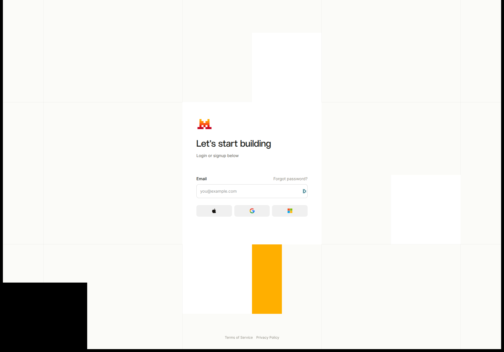
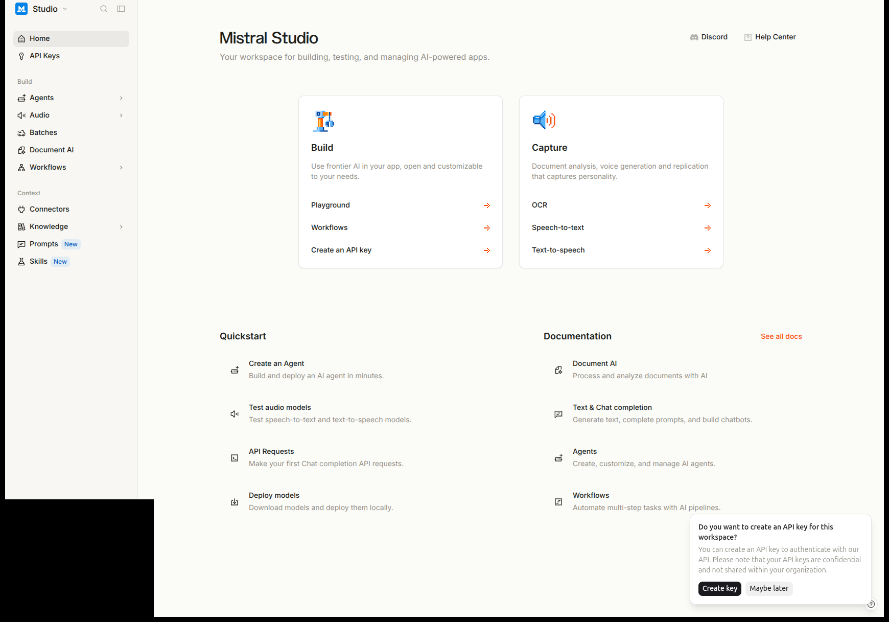
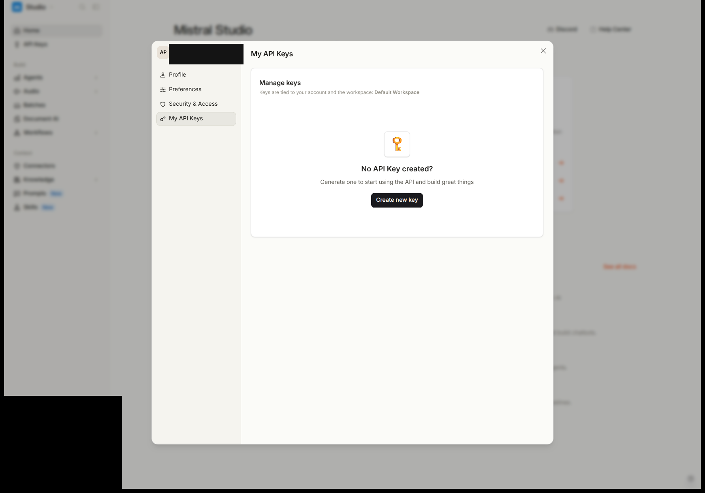
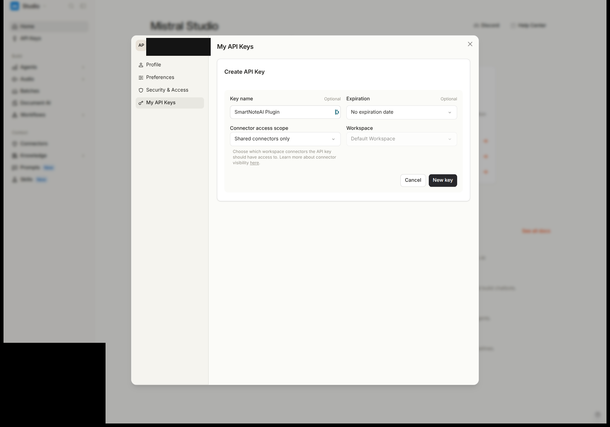
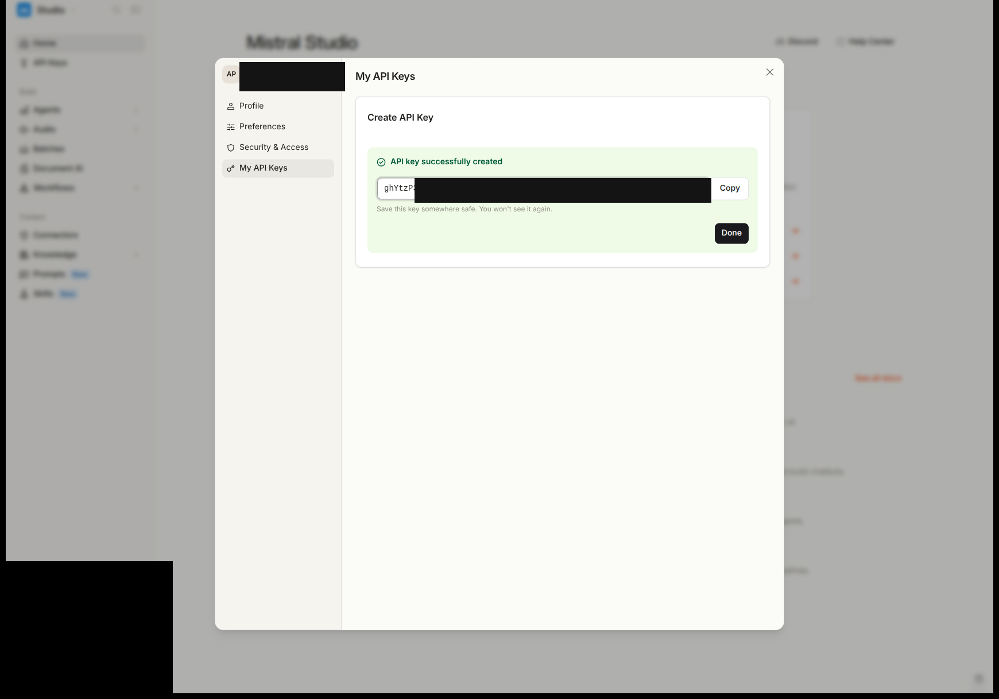
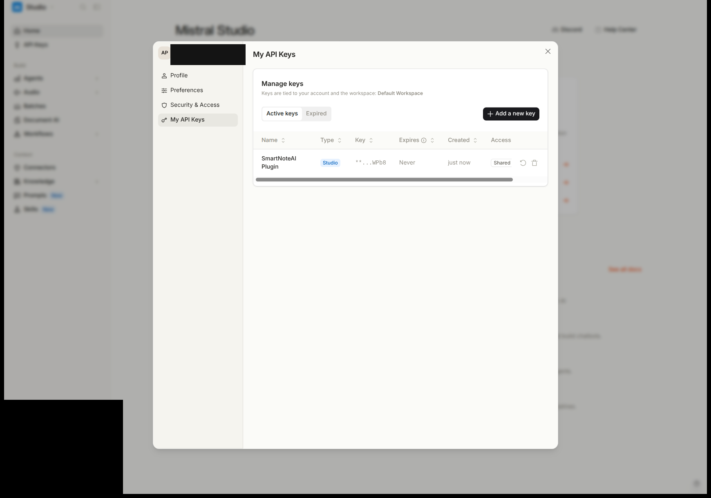

# SmartNote AI ✎

**Chat with an AI about your handwritten notes and documents — right on your Supernote, privacy first.**

SmartNote AI is a plugin for Supernote e-ink tablets (Manta, Nomad…). It puts
a Mistral AI assistant on your device: ask about the page you are writing,
lasso a corner of it for a quick question, or build a searchable library of
your own notebooks. Everything runs with your own Mistral API key, and your
transcripts never leave the tablet.

> SmartNote AI is a personal project built by a Supernote user, for
> Supernote users. It is not an official product of Supernote or Mistral
> AI, just a plugin that loves them both.

<!-- TODO screenshot: the plugin Home page — "Two ways to use it" intro, the READ / CHAT / AGENTS / SEARCH / EXPORT module map, and the config doors -->

## Two ways to use it

Pick either — or both. Nothing here is mandatory.

1. **Just ask.** Open the floating assistant on any note and ask the AI about
   the current page — or lasso part of the page and ask about that. Nothing
   has to be transcribed or stored first; it just works.
2. **Build a library (READ).** Optionally transcribe your notes and PDFs into
   a local library on the tablet. This is never required — it simply opens up
   more: powerful **SEARCH** across everything you ever wrote, **AI AGENTS**
   that always know a chosen set of documents, and **EXPORT** to `.md` / `.txt`.

Transcribing is an opportunity, not an obligation.

## The floating assistant

The **Open floating assistant** button opens a movable, resizable panel that
floats *over* your note — you keep writing on the page while you talk to the
AI about it.

<!-- TODO screenshot: the floating chat panel sitting over an open note, brain dropdown and "Chat context:" tag row visible -->

- **Brain dropdown** (the name + ▾ in the header): switch between the built-in
  **CHAT** and any of your agents. It shows the model, how many documents and
  pages are loaded, a **New chat** action and your **History**.
- **"Chat context:" tags** just under the header: the current page (or a range,
  or the whole note), extra pages you added from the Library or Search, and any
  lasso images. The page tag follows you as you turn pages.
- **Quick actions** write a ready-made prompt into the input field (summarize,
  translate, to-do list…); you send it yourself with the Mistral **M** button.
- **One-shot Web search**: arm **Web** and it applies to your next message only,
  with cited sources.
- **Answer style**: precise / balanced / creative.
- **History**: every chat is saved locally, resumable and deletable.

Follow-up questions cost a fraction of the first, thanks to Mistral's prompt
caching.

## Lasso a region

Lassoing part of a note attaches it to the chat as an image. It is not a
separate tool — it rides on whatever chat or agent is active.

<!-- TODO screenshot: a lassoed region of a note attached as a "🖼 Lasso" chip in the Chat context row -->

- The image becomes a persistent **"🖼 Lasso"** chip in the *Chat context* row;
  add several if you like, remove any with ✕.
- An editable **"Lasso — image reading"** directive (in *2 · READ*) tells the AI
  there is an image to read and act on. Leave it empty to send no instruction.
- Up to three **lasso quick actions** (default: *About this selection*, in
  *3 · CHAT & AGENTS*) appear ahead of the normal ones, but only while an image
  is in the context.

## READ: turning pages into text

READ is the engine underneath SEARCH, AGENTS and EXPORT. Handwritten pages are
read by **Mistral OCR 4** and then by a **Vision** model (Ministral); the OCR
text rides along as a hint and its word-confidence feeds a glossary of your own
vocabulary — your biggest accuracy lever. Printed PDFs are read by OCR alone
(strongest and cheapest on print); Vision is applied only where it earns its
keep — a schema or figure the OCR misses, and any page carrying handwritten
annotations.

Every file or folder has a **sync mode**, set with one tap on its chip in the
Library:

- **Off** — never sent to the AI. The privacy switch.
- **Manual** — read only when you press a Sync button (or ask the chat about it).
  Since v0.88 **Sync now is a standing order**: if the sync is interrupted (big
  backlog, offline, wrong app open) it finishes by itself on the next passes,
  Vision included — no need to tap again.
- **Auto** — read in the background, page by page, while the plugin is open.

The sync **adapts to what is on screen by itself**: note pages are read while a
note can be rendered, PDF Vision runs while a PDF reader is available, and the
SYNC STATUS panel shows which one is active ("Rendering via: …"). No page is
ever left with OCR text but no Vision — the missing Vision passes run
automatically as soon as the right app is open.

The plugin detects exactly which pages changed, so an unchanged page is never
paid for twice. Setting a chip costs nothing — you only pay when pages are
actually read.

## PDF annotations & schemas

The handwritten ink you add on top of a PDF (the Supernote `.mark` layer) is now
read too. The plugin notices changes to the `.mark` layer, so annotated pages
are picked up automatically at the next sync — and you can force a Vision read
yourself:

- **🔍 Read with Vision (schemas & annotations)** on a single PDF page.
- **🔍 Read all with Vision** on the whole document — or select pages first and
  read just those.

Once a PDF has been read, editing or adding an annotation later re-reads **only
that page**, with Vision — the rest of the document is never re-charged.

<!-- TODO screenshot: a PDF page in the Library page view, read with Vision, showing a schema/diagram and handwritten annotations captured in the transcript -->

## LIBRARY: browse, sync, fix

The Library is your local transcript store and the cockpit for syncing.

<!-- TODO screenshot: the Library with the SYNCHRONISATION panel (AUTO | MANUAL columns, SYNC STATUS bar, Keep-awake toggle) and the folder tree below -->

- A tree of your Note and Document folders (SD card included), each row showing
  its mode chip, page count and how many pages are still to read.
- A **SYNCHRONISATION** panel with side-by-side **AUTO** and **MANUAL** columns,
  an always-visible **SYNC STATUS** progress bar, and a **Keep Supernote awake
  during Sync** toggle so a big backlog can drain without the screen sleeping.
- Whole-library actions: **Export all** (`.md` / `.txt`), **Back up** / **Restore**
  the library, **Clear all transcripts**, and **Clear transcripts of Off notes**.
- Open a document to see its pages; open a page to see the transcript beside the
  original page image and the Supernote live OCR. Correct anything by hand — a
  hand-fixed page is marked *manual* and never overwritten by a later sync — or
  tap an underlined "unsure" word to fix just that one. **Clear transcript** wipes
  a single document.
- Each row also shows a badge for every agent that knows it; tap it to remove it
  from that agent.

## AI AGENTS

An agent is a custom assistant with its own name, icon, persona, model, answer
style, quick actions — and a set of Library documents it always keeps in mind.

<!-- TODO screenshot: the "3 · CHAT & AGENTS" config with an agent selected — its persona, model, and context documents with the cost estimate -->

Examples: a *Meeting notes* agent over your work notebooks; a *Recipes* agent
over your kitchen notebook; a *Thesis* agent that knows a long PDF and quotes it.

- Create up to 8 custom agents in *3 · CHAT & AGENTS* (plus the built-in CHAT).
- Four ready-made **starter presets** (Extractor, Writer, Tutor, Brainstorm) can
  be added in one tap. A fresh install ships with **no** agents.
- Build an agent's context from the Library ("+ Add to ▾ → this agent"); the
  screen shows how many pages are read and what reading the rest would cost.
- An agent's documents ride in a stable order, so Mistral's prompt cache keeps
  follow-up costs low. If some of its pages aren't read yet, the plugin offers
  to read them first — with the price — or to chat with what's already there.

## Getting started

1. Download the latest `smartnoteai-x.y.z.snplg` (or build it: `bash
   buildPlugin.sh`, with Node ≥ 18, JDK ≥ 19, Android SDK 35).
2. Copy it to `MyStyle/` on the Supernote (USB or `adb push`).
3. On the device: Settings → Apps → Plugins → Add Plugin.
4. Open the plugin from the notes toolbar and paste your Mistral API key in
   *1 · API key, privacy, backup & appearance*.

### Your Mistral API key

SmartNote AI has no middleman server and no account of ours — you bring your own
key. It takes about a minute:

**1. Sign in or create an account** at [console.mistral.ai](https://console.mistral.ai)
(email, or Google / Apple / Microsoft).

**2. Open the console (Mistral Studio)** and go to **API Keys** in the left menu
(or the *Create an API key* quickstart link).

**3. Open *My API Keys*** and click **Add a new key**.

**4. Fill in the *Create API Key* dialog:** give the key a name (e.g.
`SmartNote AI`); you can leave *Expiration*, *Connector access scope* and
*Workspace* at their defaults.

**5. Name it and confirm** with **New key**.

**6. Copy the key now — it is shown only once.**

**7. The key now appears in your list** (masked). Paste the copied value into the
plugin, door *1 · API key…*. It is stored **encrypted** in the plugin's private
directory, never in a cloud-synced folder.

> **Free tier note.** The free tier lets you use every feature, but only a
> **paid** plan guarantees Mistral never trains on your data. Field-tested in
> July 2026, the free tier allows roughly **~1300 pages** of transcription
> before you hit the monthly limit.

Every field in the plugin has **Paste / Clear / Reset-to-default**, and the
text/button-size settings apply everywhere, floating panel included. The user
guide ships as a PDF inside the plugin and can be restored from the Home page.

## Privacy first

*(Still: do not share confidential information you would not type into any cloud
service.)*

- **Fully open source** — audit this repository.
- **Mistral AI only** — a European company on European infrastructure. Your data
  stays under EU jurisdiction (GDPR). On a paid plan your requests are never used
  to train Mistral's models.
- **Bring your own key**, stored encrypted on the device.
- **Transcripts and conversations are stored locally only**, never synced. Files
  set to **Off** are never sent to the AI (a one-time per-conversation consent
  excepted, and that read is never saved).

## Why I chose one European AI: Mistral

I built SmartNote AI to talk to exactly one AI company: **Mistral AI**, based in
France. That's my deliberate choice as the author, not a missing feature. And
since you may already use ChatGPT, Claude, Gemini, or a Chinese model like
**DeepSeek or Qwen**, I owe you the reasoning.

Your handwritten notes are some of the most personal data you own: journals,
health, money, half-formed ideas, the names of the people around you. So the
real question isn't just "is the model smart?" but **"under whose laws does this
text land, and who can force access to it?"**

**How SmartNote AI already limits what leaves your device.** The design keeps
exposure small before Mistral is ever involved:

- **Your memory lives on the tablet.** Every transcript, conversation and setting
  (and your encrypted API key) is stored *on-device only*, never in a cloud
  folder. Mistral is not your memory; your tablet is.
- **Each request is transient.** A request carries only what that one question
  needs; Mistral answers and keeps no memory of you. The single piece of
  short-lived server state is a **prompt cache** (the reason a follow-up question
  costs about 10% of the first), and it expires. Between requests, Mistral holds
  nothing about you.
- **Off means off.** A file set to Off is never sent at all (a one-time,
  per-conversation consent aside, and that read is never stored).

**What the GDPR adds on top.** Because Mistral is an EU company, those transient
requests are handled under Europe's General Data Protection Regulation:

- **No training on your data** on a paid plan, and this matters more than a
  checkbox (see below).
- **Purpose limitation:** your text may be used *only* to answer your request,
  not quietly repurposed.
- **Security and minimization duties:** the company is legally required to
  protect your data and to keep no more of it than it needs.
- **Real rights, real teeth:** access and deletion are rights, enforced by
  independent regulators with fines up to 4% of worldwide revenue. Not optional
  PR.

**The problem with US providers.** Wherever the servers physically sit, US law
can compel a US company to hand over data, through the *CLOUD Act*, and through
*FISA §702*, a program that **openly authorizes the surveillance of non-US
persons'** data held by US companies. If you're not American, that program is
aimed squarely at you. And European courts have **repeatedly ruled that US
surveillance fails to meet European privacy standards**, striking down two
successive EU-US data agreements.

**The "just turn off training" objection.** Yes, several US providers now offer
a no-training opt-out. But an opt-out is only as good as your trust that it's
honored: you can't verify it, and no independent regulator stands behind it. With
an EU provider, the no-training commitment isn't a toggle you take on faith; it
rests on an enforceable legal framework.

**The problem with Chinese providers.** National-intelligence and data-security
laws oblige companies to cooperate with the state on request, and data handling
is opaque.

**"I'm in the US or in China, does an EU model even help me?"** Honestly, maybe
*more*. Two things protect you here, and neither depends on where you live:

1. **Handling.** Because Mistral is bound by the GDPR, *your* notes get
   European-grade treatment (no training on a paid plan, genuine security duties)
   that a domestic consumer AI usually won't give you.
2. **Jurisdiction.** Your notes sit with a European company on European
   infrastructure, **outside the easy reach of your own country's data-access
   laws**. US authorities can't point the CLOUD Act at a French company; Chinese
   data rules don't reach EU servers. To obtain your data, a government would
   have to go the slow, formal, cross-border route, not a quiet domestic request.

No provider makes you invisible to a determined state, and you still shouldn't
put something that would be genuinely dangerous for you into *any* cloud. But for
everyday personal notes, moving them out of your own jurisdiction and under EU
law is a real privacy gain, wherever you are.

**"Is the quality as good?"** Honest answer: for *this* job, reading your
handwriting and answering questions about your own pages, the bottleneck is how
legible your writing is and how well you've filled the glossary, not frontier
reasoning. Mistral's OCR and vision models are genuinely strong here, and I chose
them on measured results, not branding. On the very hardest open-ended reasoning
a frontier US model may still edge ahead, and that's a trade I make on purpose.
For a personal notebook, I think keeping the data in Europe is worth it.

## Costs

You pay Mistral directly, per page read:

- A handwritten page costs roughly **half a euro-cent** (OCR + Vision); printed
  PDF pages cost less (OCR only).
- **Unchanged pages are never re-paid.** Every paid action shows its estimated
  price before you confirm.
- Chat questions are billed by token; follow-ups benefit from prompt caching
  (~10% of the first). The console at
  [console.mistral.ai](https://console.mistral.ai) shows your live usage — you
  can set a monthly budget cap there to stay fully in control.

## Good to know

A few honest notes so the plugin meets your expectations:

- **You bring your own Mistral key.** There is no server of mine in the middle
  and no subscription to me — you pay Mistral directly for what you read, and
  only that. Creating a key takes two minutes (see above); a few euros of credit
  last a long time, and every paid action shows its price before you confirm.
- **Auto reads only while the plugin is open.** Background transcription runs as
  long as the SmartNote AI panel is open on the device (the *Keep awake during
  Sync* toggle stops the screen sleeping mid-backlog). Close the plugin and Auto
  simply pauses, then resumes where it left off. Manual and on-demand reads are
  unaffected.
- **It is not instant.** A page takes roughly **8–30 seconds** to read on e-ink
  (render + OCR + Vision over your connection). A first sync of a whole notebook
  is a "start it and let it run" job, not a tap-and-wait.
- **Accuracy depends on your handwriting — and the glossary is your lever.** OCR
  and Vision handle most handwriting well, but messy pages, unusual names and
  jargon trip any AI. Feed those words into the glossary (door 2) and accuracy
  jumps noticeably.
- **The interface is in English** for now.
- **Privacy, one honest caveat.** Everything is stored only on the device and
  Off files never leave it. A **paid** Mistral plan is never trained on your
  data; the **free** tier may be — so keep anything sensitive on a paid plan, or
  set those notebooks to Off.

### Requirements & tested devices

- A Supernote running **PluginHost** (the plugin framework). Built and tested on
  the **Manta** and the **A5 X**; other current models (**Nomad**, …) use the
  same framework and should work, but are less tested — please report what you
  find.
- Because a plugin rides on device internals, a **Supernote firmware update
  could briefly break it** until the plugin is updated. If something stops
  working right after a firmware update, check here for a new release first.
- Install is by side-loading the `.snplg` (copy to `MyStyle/`, then Settings →
  Apps → Plugins → Add Plugin) — there is no app store.

## Support

If you enjoy this plugin, please consider sponsoring a few tokens ;-)
My time and skills are free; the AI tokens behind this plugin are not!
Thank you for your support ☕

**https://ko-fi.com/agp42**

## Links & development

- Project & issues: **https://github.com/AgP42/SN-Plugin-SmartNoteAI**
- Built for Supernote's PluginHost (React Native 0.79.2, `sn-plugin-lib`).
- `SPEC-v0.20.md` / `SPEC-UI-v0.20.md`: architecture & UI specs.
- `HANDOVER.md`: engineering handover (version history, gotchas).
- `docs/UI-TEXTS.md`: every user-facing string, for review.

Tests: `npx jest` · Type-check: `npx tsc --noEmit`
</content>
</invoke>
